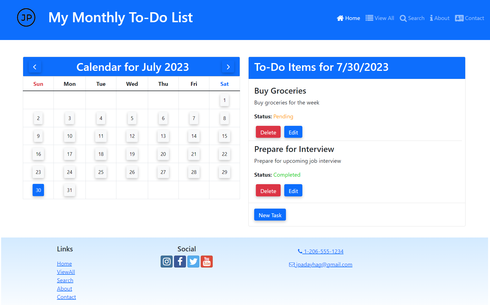

# My Monthly To-Do App



Welcome to My Monthly To-Do App! This is a simple and user-friendly to-do list app that helps you organize and manage your tasks on a monthly basis. With this app, you can easily keep track of your tasks, set their due dates, mark them as completed, and even delete them when you're done.

## Table of Contents
- [Features](#features)
- [Getting Started](#getting-started)
  - [Installation](#installation)
  - [Usage](#usage)
- [How it Works](#how-it-works)
- [Search Functionality](#search-functionality)
- [Contributing](#contributing)
- [License](#license)

## Features
- Add new tasks with titles and descriptions
- View a monthly calendar to organize tasks by date
- Mark tasks as completed
- Edit or delete tasks as needed
- Simple and intuitive user interface

## Getting Started

### Installation
To use the My Monthly To-Do App, follow these steps:

1. Clone the repository:
```
git clone https://github.com/your-username/my-monthly-todo-app.git
```

2. Install the necessary dependencies:
```
cd my-monthly-todo-app
npm install
```

### Usage
To start the app, run the following command:
```
npm start
```

The app will be accessible at `http://localhost:3000` in your web browser.

## How it Works
1. Upon launching the app, you will see a monthly calendar view with the current month and year.
2. Click on any date to view the tasks for that day.
3. To add a new task, click the "New Task" button and fill in the details.
4. To mark a task as completed, simply click the checkbox next to it.
5. To edit or delete a task, click the corresponding icons next to the task.
6. Use the navigation arrows to switch between different months.

## Search Functionality
New Feature: Search Tasks
We've added a search functionality to help you find specific tasks easily. When you type in the search box, the app will dynamically update the task list to display only those tasks that match your search criteria.

## Contributing
Contributions to improve My Monthly To-Do App are welcome! If you have any suggestions, bug fixes, or new features to add, feel free to create a pull request.

1. Fork the repository.
2. Create a new branch: `git checkout -b my-feature`
3. Commit your changes: `git commit -m "Add my feature"`
4. Push to the branch: `git push origin my-feature`
5. Submit a pull request.

## License
This project is licensed under the [MIT License](LICENSE). Feel free to use, modify, and distribute the code as per the terms of the license.
